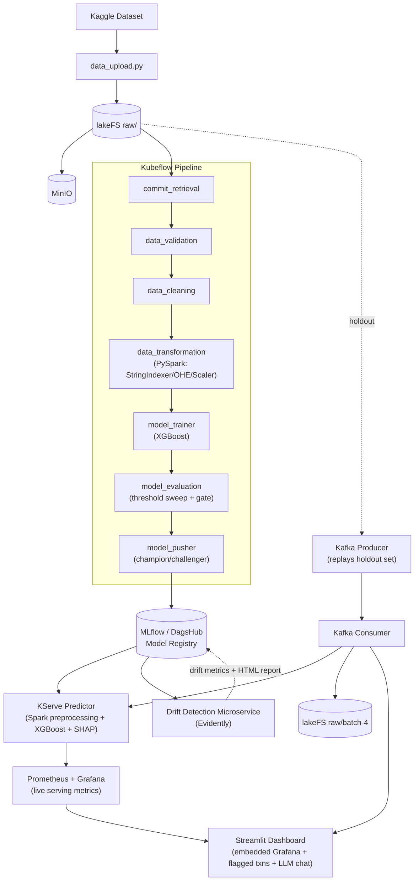
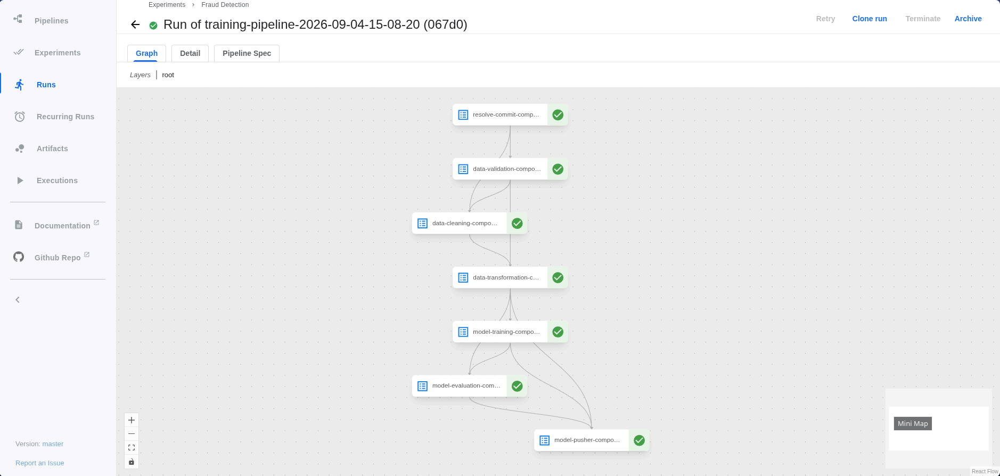
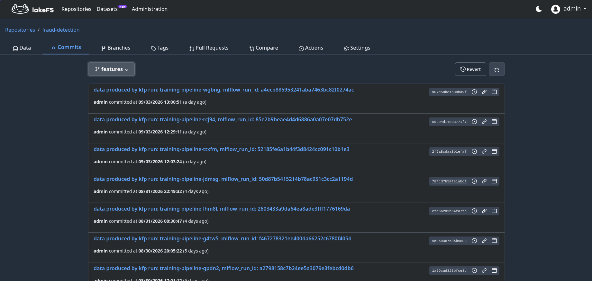
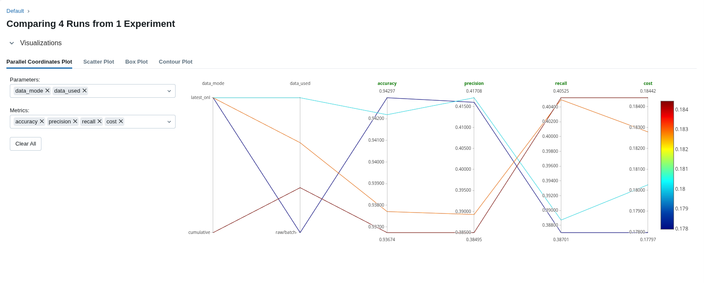
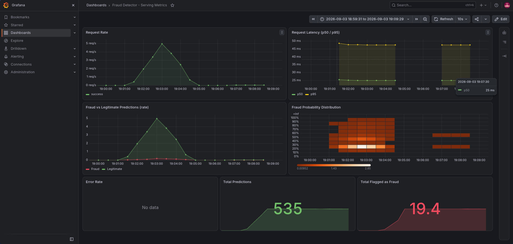
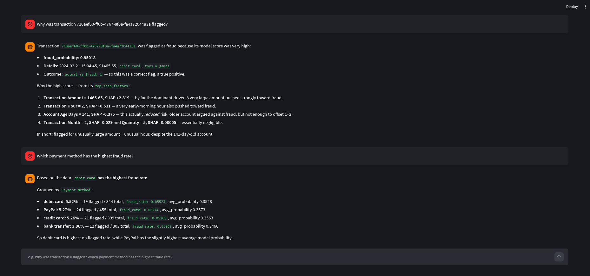

# Fraud Detection — AI Risk Manager

An end-to-end MLOps system for e-commerce fraud detection, built for Razorpay /buildathon's **Track 02: AI Risk Manager**. The focus here is not novel modeling — it's a production-shaped pipeline around it: versioned data, gated evaluation, honest metrics, explainable predictions, and live monitoring.

> **TL;DR**: XGBoost fraud classifier, trained via a fully orchestrated Kubeflow Pipeline, versioned with lakeFS, tracked in MLflow with automatic champion/challenger promotion, served via KServe with real-time SHAP explanations, monitored with Prometheus/Grafana, evaluated against a true held-out set replayed through Kafka, watched for drift by a standalone microservice, and explorable through a Streamlit dashboard with an LLM analyst chat grounded in the actual prediction data.

---

## Results

| Metric | Value |
|---|---|
| Accuracy | 94% |
| Precision | 38% |
| Recall | 42% |
| Cost (rate-weighted, 5:1 FN:FP) | 0.18 |

Metrics are computed on a **true held-out set** — transactions the model never saw during training or hyperparameter tuning, can be found at notebooks/final_evaluation.ipynb. These can also be relayed in through kafka to simulate a real production environment. See [Evaluation Methodology](#evaluation-methodology) for why this distinction matters.

---

## Architecture

---
## Pipeline run (Kubeflow UI):


---

## Key Engineering Decisions

Documenting these explicitly, since the reasoning matters as much as the result:

- **Cost-weighted promotion, not accuracy.** On ~5% fraud prevalence, accuracy is trivially gamed by predicting "not fraud" for everything. Champion/challenger comparison uses a rate-based cost (`FN_rate × 5 + FP_rate × 1`) — normalized by class size so it stays comparable across differently-sized/balanced evaluation sets, not raw counts.
- **Decision threshold is swept, not fixed at 0.5.** `model_evaluation` searches candidate thresholds and selects the one minimizing cost, since `scale_pos_weight`-rebalanced models make the default 0.5 cutoff the wrong operating point.
- **Two-stage promotion gate.** `model_evaluation` checks an *absolute* quality floor independent of the current champion; `model_pusher` only then compares *relatively* against a freshly re-evaluated champion — on the **same test set**, not the champion's own historically-logged number, since (a) a model trained on more data will naturally look worse on its own harder test set even if more generalizable, and (b) a model performing well on historical data, but not on new data is not useful even if the training sizes are comparable
- **lakeFS for data lineage, not just storage.** Every training run resolves and pins an exact commit hash before running — cache correctness and reproducibility both depend on content-addressing the data, not trusting a branch name or a fixed path.
- **KServe predictor combines preprocessing and inference in one service**, rather than the standard predictor/transformer split — since preprocessing here is inherently tied to a fitted Spark ML pipeline, the split buys no flexibility, only complexity.
- **SHAP-based per-prediction explainability**, with feature names and category labels resolved back from the fitted pipeline's own metadata — not raw feature indices.
- **Honest holdout evaluation.** The reported metrics above come from replaying the true holdout set through the live serving path via Kafka, not from a train/test split reused during development.

### Disclosed deviations from the reference notebook
- `tree_method="hist"` (CPU) instead of the notebook's `"gpu_hist"` — no GPU in this environment.
- Feature engineering approach adapted from `https://www.kaggle.com/code/veerpatel6693/fraud-prediction`; the pipeline, versioning, evaluation gating, and serving infrastructure are original.

---

## Tech Stack

| Layer | Tools |
|---|---|
| Data versioning | lakeFS, MinIO |
| Processing | PySpark |
| Orchestration | Kubeflow Pipelines |
| Experiment tracking / registry | MLflow (via DagsHub) |
| Model | XGBoost |
| Serving | KServe, custom Python predictor |
| Streaming | Kafka |
| Monitoring | Prometheus, Grafana |
| Drift detection | Evidently |
| Demo UI | Streamlit |
| CI/CD | GitHub Actions |
| Infra | minikube, Docker |

---

## Data Versioning

Every raw batch and every training run's commit is tracked in lakeFS — full lineage from source data to trained model.



---

## Experiment Tracking & Champion/Challenger Promotion

Every run — win or lose — is logged with full parameters and metrics in MLflow, nested under its parent pipeline run. Only models that beat the current champion (re-evaluated fresh, on the same test set) get promoted.



---

## Live Serving & Monitoring

The deployed model is scored in real time via Kafka-replayed traffic, with request volume, latency, and the fraud/legitimate prediction split visible on a live Grafana dashboard.



---

## Drift Detection

A standalone microservice periodically compares the champion's training data against a current data window using Evidently, exposing `dataset_drift_detected` and `drift_share` as Prometheus metrics and logging a full HTML report to MLflow per check.

An example report is included at [`eg_drift_report.html`](./eg_drift_report.html) — open it directly in a browser to see the full column-by-column drift breakdown.

---

## Demo: Explainable Fraud Analyst Chat

The Streamlit dashboard includes a tool-using LLM assistant grounded in the actual scored transaction data — it queries real prediction records and SHAP factors rather than answering from general knowledge.



---

## Repository Structure

```
.
├── app.py                     # Streamlit demo: embedded Grafana, flagged transactions, LLM chat
├── data_upload.py             # One-time ingestion: Kaggle → chronological batches → lakeFS
├── eg_drift_report.html       # Example Evidently drift report
├── config/schema.yaml         # Column roles: categorical / numeric / passthrough / target
├── src/
│   ├── components/            # Kubeflow Pipeline components
│   │   ├── commit_retrieval.py
│   │   ├── data_validation.py
│   │   ├── data_cleaning.py
│   │   ├── data_transformation.py
│   │   ├── model_trainer.py
│   │   ├── model_evaluation.py
│   │   └── model_pusher.py
│   ├── configuration/lakefs_connection.py
│   ├── entity/config_entity.py
│   ├── pipeline/
│   │   ├── training_pipeline.py
│   │   ├── prediction_pipeline.py
│   │   ├── inference-service.yaml   # KServe InferenceService
│   │   └── kserve.pod_monitor.yaml  # Prometheus PodMonitor for the predictor
│   └── utils/main_utils.py
├── kafka_files/
│   ├── producer.py            # Replays holdout set as simulated live traffic
│   └── consumer.py            # Scores each row, logs predictions, commits batch-4.parquet
├── drift-detection/
│   ├── drift_detector.py      # Evidently-based drift microservice
│   ├── drift-detection.yaml   # Deployment + PodMonitor
│   └── Dockerfile
├── notebooks/
│   ├── fraud-prediction.ipynb         # Reference EDA + model comparison
│   └── hyperparameter_tuning.ipynb    # Optuna search
├── screenshots/                # README images
├── Dockerfile.base-env         # Base image: PySpark, lakeFS, no training deps
├── Dockerfile.inference        # Serving/training image: adds MLflow, XGBoost, KServe
├── docker-compose.lakefs.yml
├── docker-compose.kafka.yml
└── .github/workflows/          # CI: builds + pushes images on src/config changes
```

---

## Setup

**Prerequisites**: Docker, minikube, `kubectl`, Python 3.10, a Kaggle account, a DagsHub account.

1. **Local infra**: `docker compose -f docker-compose.lakefs.yml up -d` (lakeFS + MinIO), `docker compose -f docker-compose.kafka.yml up -d` (Kafka).
2. **Data ingestion**: `python data_upload.py` — pulls the dataset, splits chronologically, commits `batch-1` to lakeFS as the initial training set; holdout set committed separately.
3. **Cluster**: `minikube start`, install Kubeflow Pipelines, KServe, and `kube-prometheus-stack`.
4. **Secrets**: create `pipeline-secrets` (lakeFS, DagsHub, MinIO credentials) in every namespace that needs it — `kubeflow`, `kserve`, and wherever the drift detector runs.
5. **Images**: build and push via the included Dockerfiles, or let CI handle it on push to `main`.
6. **Pipeline**: `python src/pipeline/training_pipeline.py` to compile and upload, then trigger a run from the Kubeflow UI.
7. **Serving**: `kubectl apply -f src/pipeline/inference-service.yaml`.
8. **Monitoring**: `kubectl apply -f src/pipeline/kserve.pod_monitor.yaml` and `drift-detection/drift-detection.yaml`.
9. **Demo loop**: run `kafka_files/producer.py`, then `kafka_files/consumer.py`, then `demo.py` to compute final holdout metrics.
10. **Dashboard**: `streamlit run app.py`.

---

## Evaluation Methodology

Two distinct evaluation stages, intentionally separated:

1. **During training** (`model_evaluation`/`model_pusher`): scored against a train/test split of the *training* batch — used only for gating and promotion decisions, not reported as the headline metric.
2. **Final reported metrics** (this README, the demo): scored against a set held out since ingestion, never seen in any training run, when replayed through the actual deployed serving path via Kafka — as close to a genuine production evaluation as this environment allows.

**Known limitation**: once the holdout set is replayed, it's committed to lakeFS as `batch-4` and becomes eligible for future training. It remains a valid holdout for the *current* champion (a trained model has no memory of inference-time data — evaluating it repeatedly changes nothing), but a future retrain would need a freshly carved-out holdout to preserve this guarantee.

---

## License

See [LICENSE](./LICENSE).
